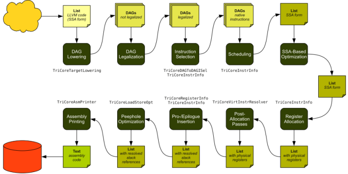
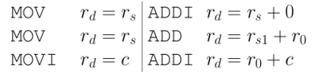
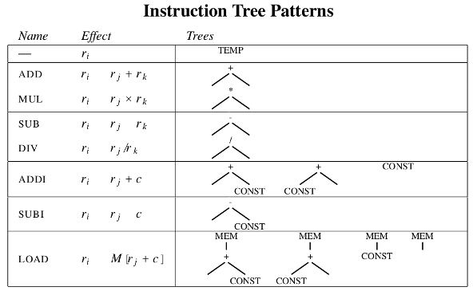
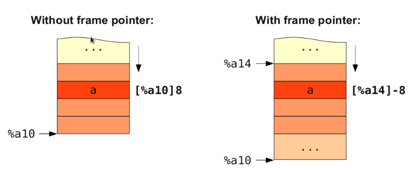

.. _backend_structure:

======================
LLVM Backend Structure
======================

This chapter introduces the LLVM backend class inheritance tree and class members
first. Next, we follow the LLVM backend structure and add class implementation one
by one in each section. In this chapter, we need some compiler knowledge, like
`DAG <http://en.wikipedia.org/wiki/Directed_acyclic_graph>`_ and `instruction
selection <http://en.wikipedia.org/wiki/Instruction_selection>`_, we will introduce
them when needed. At the end of this chapter, we will have a backend being able
to compile LLVM IR into cpu0 assembly code.

The code added in this chapter are common in every LLVM backend, the only difference
are their name. In fact, since Cpu0 is similar to Mips we copy most of the code from
the Mips backend. In this chapter, we will focus on the relationship between classes
involved in writing a LLVM backend. Once knowing the overall structure, you can
quickly create a simple backend from scratch.

Overview
========

.. note::
   Following content came from "Design and Implementation of a TriCore Backend for the LLVM Compiler Framework" [6]_ Chapter 4. I already got author's approve on the Chinese translation work. :-) 

As mentioned in Chapter 2, LLVM provides developers with an extensive generic frame
work for code generation. It prescribes a fixed directory layout and class hierarchy
template. Each backend is located in its own subdirectory within lib/Target, where
most of the code to be implemented goes. Apart from this, only a handful of the original
files in the LLVM source tree have to be modified in order to integrate the new backend
with the existing LLVM codebase.

如同第二章所提到，LLVM 提供開發者一套相當通用的框架用來開發後端。LLVM 提供一個
固定的目錄布局，和類別階層。每一個後端都位在各自位於 ``lib/Target`` 的子目錄，
大部分的實作代碼都在該子目錄底下。除此之外，只有少部分 LLVM 代碼需要修改以將
新增的後端整合進 LLVM 代碼庫。

The target code generator is divided into several components, each of which is discussed
in a separate section. For a better overview, each section contains a list of the source
files that comprise the respective component

目標後端被分為數個元件，底下各節將分別加以討論。為了加強讀者整體印象，各節會列出
相應的檔案。

The given class hierarchy specifies a number of abstract base classes with virtual
functions and requires the backend developer to implement subclasses for each of them.
Most of these classes do not provide any immediate functionality for code generation, but
merely give selected information about the characteristics and properties of the target
machine. This makes it possible to keep the bulk of the actual algorithms and procedures
fully target-independent by accessing all the required target-specific information through
the specified interfaces.

LLVM 的類別階層指定數個抽象基礎類別，其中定義數個虛擬函式。後端開發者必須實做前述
抽象類別的子類別，並依據需要實做虛擬函式。大部分的類別僅提供目標的各項資訊和特性，
與後端代碼生成並不相關。這使得演算法和其它程序與底層目標無關，僅透過指定的界面存取
目標資訊。


Code Generation Process
=======================

為了瞭解 LLVM 後端的結構，先理解 LLVM  後端是如何生成目標代碼是必要的。
將 LLVM IR 轉成目標代碼，後端需要經過數個步驟 [#]_ 。

Instruction Selection
---------------------

目標代碼生成的第一步，是將 LLVM IR 轉成一組 ``SelectionDAG`` ，
這是一個有向無環圖，其中每一個節點代表一條 LLVM 指令。任兩條指令之間的 definition-use
關係由一條從 using node 指向 defining node 的邊描述，邊上伴隨受影響變數的型別其資訊。
如果指令之間有 control flow dependency ，會以額外的邊加以表示。由於目標並不保證支持
所有 LLVM 提供的型別和操作，前述的 DAG 必須先加以合法化，也就是要先將其轉成目標支持
的型別和操作。合法化的 DAG 再交由 instruction selector 以樣式匹配的方式，創建以目標
指令為內容的 DAG 節點。對於每一個匹配到的 LLVM DAG 節點，相應目標指令的 DAG 節點
會被建立。instruction selector 的輸入和輸出都是 DAG，只是其內容由 LLVM 指令轉成目標指令。

Scheduling and Formation
------------------------

前述由目標指令所構成的的 DAG 將會在此階段被解構成目標指令序列 (list)。每一個函式以
一個 `MachineFunction`_ 加以表示，其中包含 `MachineBlock`_ 串列。 `MachineBlock`_
中又包含數條 `MachineInstr`_ 。Scheduler 必須決定以何種順序將目標指令寫出，這會受
到許多因素影響，例如: 最小 register pressure，亦即減少因暫存器數量不足，而需要將
暫存器內容暫時搬移至內存的次數。

此時，目標指令序列仍舊保持 SSA 形式，它並非合法的匯編。除了少數例外 (像是將返回值
搬移至 ABI 所規定的暫存器)，所有的指令仍舊操作 LLVM 提供的無限量虛擬暫存器，且所有
存取棧的指令均是存取虛擬的棧空間，而非真正的偏移量。

.. _MachineFunction: http://llvm.org/docs/doxygen/html/classllvm_1_1MachineFunction.html

.. _MachineBlock: http://llvm.org/docs/doxygen/html/classllvm_1_1MachineBasicBlock.html

.. _MachineInstr: http://llvm.org/docs/doxygen/html/classllvm_1_1MachineInstr.html

SSA-based Machine Code Optimization
-----------------------------------

在分配物理暫存器之前，後端有機會針對保有 SSA 形式的目標指令序列進行 SSA 相關的優化。

Register Allocation
-------------------

虛擬暫存器將在此階段被消除，改以物理暫存器對應之。LLVM 暫存器分配器將會為每一個虛擬
暫存器分配一個物理暫存器。如果虛擬暫存器數量超過實際可用的物理暫存器，暫存器分配器
會產生 spill code 將某個物理暫存器搬移至內存以供使用。因為暫存器有可能重疊，例如:
``%e2`` 暫存器分別由 ``%d3`` 和 ``%d2`` 構成其上下半部，暫存器分配器必須考慮到這種
情況。虛擬暫存器的消除同時伴隨著 SSA 形式的解構。為建立 SSA 形式所插入的 phi 指令
將被 copy 指令所取代。

Prologue/Epilogue Code Insertion
--------------------------------

在暫存器分配器運行之後，我們可以計算每一個函式將會需要多少棧空間。進而在函式的出入口
寫入相對應的 prologue 和 epilogue。之前存取虛擬棧空間的指令，現在可以存取到相對應
棧頂 (sp) 或是棧底 (fp) 指針的偏移量。

Late Machine Code Optimizations
-------------------------------

在將目標指令寫出之前，可以做窺孔優化 (peephole optimization)，對目標指令做細部調整。

Code Emission
-------------

最後，完整的目標代碼被寫出。對於靜態編譯，其結果可以是匯編文本; 對於 JIT 編譯，目標指
令的編碼將被寫入內存。

General Target Information
==========================

每一個 LLVM 後端都必須要提供一個介面供上層原件調用。後端必須實現 `LLVMTargetMachine`_
的子類，提供目標平台必要資訊，並向 LLVM 代碼生成器註冊。

.. _LLVMTargetMachine: http://llvm.org/docs/doxygen/html/classllvm_1_1LLVMTargetMachine.html

Target Machine Characteristics
------------------------------

類別 ``XXTargetMachine`` 扮演著中心的角色，它是目標後端和 LLVM 其它原件之間的界面。
它創建並擁有數個物件描述目標平台資訊，LLVM 代碼生成器透過 ``XXTargetMachine`` 取
得相應資訊。

* `DataLayout`_ 描述目標的資料佈局，如: 大小端，指針寬度和內存對齊。

* `TargetFrameLowering`_ 描述目標棧框佈局。它指明棧生長方向、棧上空間的對齊要求和本地變數應從棧底何處偏移量開始存取。

* 其它類別諸如: `TargetInstrInfo`_ 、 `TargetLowering`_ 和  `TargetRegisterInfo`_ 。底下各節會分別加以描述。

.. _DataLayout : http://llvm.org/docs/doxygen/html/classllvm_1_1DataLayout.html

.. _TargetFrameLowering : http://llvm.org/docs/doxygen/html/TargetFrameLowering_8h.html

.. _TargetInstrInfo: http://llvm.org/docs/doxygen/html/TargetInstrInfo_8h_source.html

.. _TargetLowering : http://llvm.org/docs/doxygen/html/TargetLowering_8h.html

.. _TargetRegisterInfo: http://llvm.org/docs/doxygen/html/TargetRegisterInfo_8h_source.html

Subtarget Information
---------------------

Build Example Code
==================

We build our example code first, then add components step by step.

#. Prepare the source code.

    .. code-block:: bash

     $ cd cpu0
     $ mkdir -p 3/src; cd 3/src
     $ cp -rf ../../2/src/* .
     $ cp -rf $Example_SRC/3/1/Cpu0/ lib/Target/

#. Build

    .. code-block:: bash

     $ mkdir debug; cd debug
     $ cmake -DCMAKE_CXX_COMPILER=clang++ -DCMAKE_C_COMPILER=clang \
       -DLLVM_TARGETS_TO_BUILD="Mips;Cpu0" \
       -DCMAKE_BUILD_TYPE=Debug -G "Unix Makefiles" ../src/

Step 1. Add XXTargetMachine
---------------------------

The role of TargetMachine in the LLVM backend structure is shown in :num:`figure #target-machine`. `llc
<http://llvm.org/docs/CommandGuide/llc.html>`_ is LLVM static compiler.
When you invoke ``llc`` command with option ``-march=XX``, it will trigger the
corresponding callback functions.

.. _target-machine:

.. figure:: ../Fig/backendstructure/target_machine.png
   :figclass: align-center

   The role of TargetMachine

`Target Machine <http://llvm.org/docs/WritingAnLLVMBackend.html#target-machine>`_ is
a base class for targets implemented with the LLVM target-independent code generator.
You should define a ``XXTargetMachine`` class which inherit class ``LLVMTargetMachine``,
where XX is your target name. In our tutorial we name it as ``Cpu0TargetMachine``.
Class Cpu0TargetMachine has data members which define target layout, instruction
information, frame/stack ...etc. The Cpu0TargetMachine contents as follows,

.. _cpu0-target-machine:

.. literalinclude:: ../code_fragment/backendstructure/1.txt

Due to the OO design of LLVM, most member functions are already implemented by
base classes. We only need to override some member functions for our target machine.

After writing up our target description files, ``llvm-tblgen`` generates C++ files
included by others. Take ``Cpu0InstrInfo.td`` as an example, ``llvm-tblgen`` generates
``Cpu0GenInstrInfo.inc`` from ``Cpu0InstrInfo.td``. Then ``Cpu0InstrInfo.h`` defines
``GET_INSTRINFO_HEADER`` marco so that it can get code it needs from ``Cpu0GenInstrInfo.inc``
Below is the code fragment from Cpu0GenInstrInfo.inc.

Code between ``#if def  GET_INSTRINFO_HEADER`` and ``#endif // GET_INSTRINFO_HEADER`` 
will be extracted by ``Cpu0InstrInfo.h.``

.. literalinclude:: ../code_fragment/backendstructure/2.txt

Reference Write An LLVM Backend web site [#]_.

    .. code-block:: bash

     $ cp -rf $Example_SRC/3/1/Cpu0 lib/Target

We add the following files in this section, and we have to modify CMakefile.txt
to include thhose new added C++ files.

#. Cpu0TargetMachine.[h,cpp]

#. Cpu0Subtarget.[h,cpp]

#. Cpu0InstrInfo.[h,cpp]

#. Cpu0FrameLowering.[h,cpp]

#. Cpu0TargetLowering.[h,cpp]

#. Cpu0SelectionDAGInfo.[h,cpp]

.. literalinclude:: ../code_fragment/backendstructure/3.txt

Please follow commands below to build example code for this section.

#. Prepare the source code.

    .. code-block:: bash

     $ cd cpu0
     $ mkdir -p 3/1/src; cd 3/1/src
     $ cp -rf ../../../2/src/* .
     $ cp -rf $Example_SRC/3/1/Cpu0/ lib/Target/

#. Build

    .. code-block:: bash

     $ mkdir debug; cd debug
     $ cmake -DCMAKE_CXX_COMPILER=clang++ -DCMAKE_C_COMPILER=clang \
       -DLLVM_TARGETS_TO_BUILD="Mips;Cpu0" \
       -DCMAKE_BUILD_TYPE=Debug -G "Unix Makefiles" ../src/

Step 2. Add RegisterInfo
------------------------

class `Cpu0InstrInfo` has a data member of class `Cpu0RegisterInfo`. 
This section adds class `Cpu0RegisterInfo`, then includes it in `Cpu0InstrInfo.h`
and `Cpu0TargetMachine.h`. Finally, we modify CMakefile.txt to add our new added
file `Cpu0RegisterInfo.cpp`.

.. literalinclude:: ../code_fragment/backendstructure/4.txt

Now, let's replace 3/1/Cpu0 with 3/2/Cpu0 of adding register class definition 
and rebuild. 

#. Prepare the source code.

    .. code-block:: bash

     $ cd cpu0/3
     $ mkdir -p 2/src; cd 2/src
     $ cp -rf ../../1/src/* .
     $ cp -rf $Example_SRC/3/2/Cpu0/ lib/Target/

#. Build

    .. code-block:: bash

     $ mkdir debug; cd debug
     $ cmake -DCMAKE_CXX_COMPILER=clang++ -DCMAKE_C_COMPILER=clang \
       -DLLVM_TARGETS_TO_BUILD="Mips;Cpu0" \
       -DCMAKE_BUILD_TYPE=Debug -G "Unix Makefiles" ../src/

Now, let's run ``llc`` to compile a LLVM bitcode to see what happen.

#. Prepare LLVM bitcode.

    .. code-block:: bash

     $ clang -c example/input/ch3.cpp -emit-llvm -o ch3.bc       

#. Compile 

    .. code-block:: bash

     $ llc -march=cpu0 -relocation-model=pic -filetype=asm ch3.bc -o ch3.cpu0.s

.. code-block:: bash

     llc: /cpu0/3/2/src/lib/CodeGen/LLVMTargetMachine.cpp:78: llvm::LLVMTargetMachine::LLVMTargetMachine(const llvm::Target &, llvm::StringRef, llvm::StringRef, llvm::StringRef, llvm::TargetOptions, Reloc::Model, CodeModel::Model, CodeGenOpt::Level): Assertion `AsmInfo && "MCAsmInfo not initialized." "Make sure you include the correct TargetSelect.h" "and that InitializeAllTargetMCs() is being invoked!"' failed.
     Stack dump:
     0.      Program arguments: ./bin/llc -march=cpu0 -relocation-model=pic -filetype=asm ch3.bc -o ch3.cpu0.s
     Aborted

Look into the assertion in above error message, it tell us that we don't have
a ASMPrinter for our target to print assembly. We will add it in next section.

Step 3. Add AsmPrinter
----------------------

First, wee modify ``Cpu0.td`` to add support for ASMPrinter. LLVM now has a newer
ASMPrinter called MCAsmWriter, we explictly say we will support MCAsmWriter.

.. literalinclude:: ../code_fragment/backendstructure/5.txt

``llvm-tblgen`` will generate ``Cpu0GenAsmWrite.inc`` included by ``Cpu0InstPrinter.cpp``
which will be added soon. ``Cpu0GenAsmWrite.inc`` implements two member functions:
``printInstruction`` and ``getRegisterName`` for class ``Cpu0InstPrinter``.
Both of them are auto-generated from target description files we added before,
i.e., ``Cpu0InstrInfo.td`` and ``Cpu0RegisterInfo.td``. The last thing we have to
do is adding class ``Cpu0InstPrinter``, then include ``Cpu0GenAsmWrite.inc`` in it.

.. literalinclude:: ../code_fragment/backendstructure/6.txt

Next, add files below into new subdirectory ``MCTargetDesc``.

#. Cpu0AsmPrinter.[h,cpp]

#. Cpu0MCInstLower.[h,cpp]

#. Cpu0BaseInfo.[h,cpp]

#. Cpu0FixupKinds.[h,cpp]

#. Cpu0MCAsmInfo.[h,cpp]

We register our target MCAsmInfo and InstPrinter in ``Cpu0MCTargetDesc.cpp``.

.. literalinclude:: ../code_fragment/backendstructure/7.txt

Then we register AsmPrinter in ``Cpu0AsmPrinter.cpp``.

.. literalinclude:: ../code_fragment/backendstructure/8.txt

This sections adds two subdirectories: ``InstPrinter`` and ``MCTargetDesc``.
You have to modify top-level LLVMBuild.txt and CMakefile.txt accordingly,
and add LLVMBuild.txt and CMakefile.txt into those subdirectories also.

.. literalinclude:: ../code_fragment/backendstructure/9.txt

O.K., let's build example code, then run ``llc`` as before. You will see
error below:

.. code-block:: bash

   $ ./bin/llc -march=cpu0 ../../2/debug/ch3.bc
   ./bin/llc: target does not support generation of this file type!

``llc`` fails to compile LLVM IR into target machine code since we don't
implement class ``Cpu0DAGToDAGISel`` yet. Before moving on, we will introduce
LLVM code generation sequence, DAG, and instruction selection in next three 
sections.

LLVM Code Generation Sequence
=============================

.. note::
Following content came from
"Design and Implementation of a TriCore Backend for the LLVM Compiler Framework"
[6]_ section 4.2 Code Generation Process.

:num:`figure #code-generation-sequence`
gives an overview of LLVM code generation sequence.

.. _code-generation-sequence:



   LLVM code generation sequence

LLVM IR is a Static Single Assignment (SSA) [#]_ based representation. 
LLVM provides infinite virtual registers which can hold value of primitive 
type (integral, floating point, or pointer). 
So, every operand can save in different virtual register in LLVM SSA 
representation. 
Comment is prefixed with ``;`` in LLVM representation. 

Following is a LLVM IR example.

.. literalinclude:: ../code_fragment/backendstructure/10.txt

We explain the code generation process as below. 
If you don't feel comfortable, please check tricore_llvm.pdf section 4.2 first. 
You can  read “The LLVM Target-Independent Code Generator” from [#]_ 
and “LLVM Language Reference Manual” from [#]_ 
before go ahead, but we think read section 
4.2 of tricore_llvm.pdf is enough. 
We suggest you read the web site documents as above only when you are still not 
quite understand, even though you have read this section and next 2 sections 
article for DAG and Instruction Selection.

"Design and Implementation of a TriCore Backend for the LLVM Compiler Framework"
[#]_ section 4.2.

#. Instruction Selection

    .. literalinclude:: ../code_fragment/backendstructure/11.txt

#. Scheduling and Formation

    .. literalinclude:: ../code_fragment/backendstructure/12.txt

#. SSA-based Machine Code Optimization

    For example, common expression remove, shown in next section DAG.
	
#. Register Allocation

    Allocate real register for virtual register.
	
#. Prologue/Epilogue Code Insertion

    Explain in section Add Prologue/Epilogue functions
	
#. Late Machine Code Optimizations

    Any "last-minute" peephole optimizations of the final machine code can
    be applied during this phase. For example, replace "x = x * 2" by 
    "x = x < 1" for integer operand.
	
#. Code Emission

    Finally, the completed machine code is emitted. For static compilation,
    the end result is an assembly code file; for JIT compilation, the opcodes
    of the machine instructions are written into memory. 

DAG (Directed Acyclic Graph)
----------------------------

Many important techniques for local optimization begin by transforming a basic 
block into DAG. For example, the basic block code and it's corresponding DAG as 
:ref:`backendstructure_f6`.

.. _backendstructure_f6: 
.. figure:: ../Fig/backendstructure/6.png
	:align: center

	DAG example

If b is not live on exit from the block, then we can do common expression 
remove to get the following code.

.. literalinclude:: ../code_fragment/backendstructure/13.txt

As you can imagine, the common expression remove can apply in IR or machine 
code.

DAG like a tree which opcode is the node and operand (register and 
const/immediate/offset) is leaf. 
It can also be represented by list as prefix order in tree. 
For example, (+ b, c), (+ b, 1) is IR DAG representation.


Instruction Selection
---------------------

In the compiler backend, we need to translate compiler intermediate representation
, i.e., IR code into machine code at instruction selection stage [#]_.

:num:`figure #ir-and-machine-code` shows a simple example to illustrate the
before and after instruction selection.

.. _ir_and_machine_code:


	IR and it's corresponding machine instruction

For machine instruction selection, the better solution is represent IR and 
machine instruction by DAG. 
In :num:`figure #instruction-tree-patterns`, we skip the register leaf. 
The rj + rk is IR DAG representation (for symbol notation, not llvm SSA form). 
ADD is machine instruction.

.. _instruction-tree-patterns:


	Instruction DAG representation

The IR DAG and machine instruction DAG can also represented as list. 
For example, (+ ri, rj), (- ri, 1) are lists for IR DAG; (ADD ri, rj), 
(SUBI ri, 1) are lists for machine instruction DAG.

Now, let's recall the ADDiu instruction defined on Cpu0InstrInfo.td in the 
previous chapter. 
And It will expand to the following Pattern as mentioned in section Write td 
(Target Description) of the previous chapter as follows,

.. literalinclude:: ../code_fragment/backendstructure/14.txt

This pattern meaning the IR DAG node **add** can translate into machine 
instruction DAG node ADDiu by pattern match mechanism. 
Similarly, the machine instruction DAG node LD and ST can be got from IR DAG 
node **load** and **store**.

Some cpu/fpu (floating point processor) has multiply-and-add floating point 
instruction, fmadd. 
It can be represented by DAG list (fadd (fmul ra, rc), rb). 
For this implementation, we can assign fmadd DAG pattern to instruction td as 
follows,

.. literalinclude:: ../code_fragment/backendstructure/15.txt

Similar with ADDiu, [(set F4RC:$FRT, (fadd (fmul F4RC:$FRA, F4RC:$FRC), 
F4RC:$FRB))] is the pattern which include node **fmul** and node **fadd**.

Now, for the following basic block notation IR and llvm SSA IR code,

.. literalinclude:: ../code_fragment/backendstructure/16.txt

The llvm SelectionDAG Optimization Phase (is part of Instruction Selection 
Process) prefered to translate this 2 IR DAG node (fmul %a, %b) (fadd %d, %c) 
into one machine instruction DAG node (**fmadd** %a, %c, %b), than translate 
them into 2 machine instruction nodes **fmul** and **fadd**.

.. literalinclude:: ../code_fragment/backendstructure/17.txt

As you can see, the IR notation representation is easier to read then llvm SSA 
IR form. 
So, we  use the notation form in this book sometimes.

For the following basic block code,

.. literalinclude:: ../code_fragment/backendstructure/18.txt

We can apply :ref:`backendstructure_f7` Instruction tree pattern to get the 
following machine code,

.. literalinclude:: ../code_fragment/backendstructure/19.txt


Step 4. Add Cpu0DAGToDAGISel
----------------------------

The IR DAG to machine instruction DAG transformation is introduced in the 
previous section. 
Now, let's check what IR DAG node the file ch3.bc has. List ch3.ll as follows,

.. literalinclude:: ../code_fragment/backendstructure/20.txt

As above, ch3.ll use the IR DAG node **store**, **ret**. Actually, it also use 
**add** for sp (stack point) register adjust. 
So, the definitions in Cpu0InstInfo.td as follows is enough. 
IR DAG is defined in file  include/llvm/Target/TargetSelectionDAG.td.

.. literalinclude:: ../code_fragment/backendstructure/21.txt

Add  class Cpu0DAGToDAGISel (Cpu0ISelDAGToDAG.cpp) to CMakeLists.txt, and add 
following fragment to Cpu0TargetMachine.cpp,

.. literalinclude:: ../code_fragment/backendstructure/22.txt

This version adding the following code in Cpu0InstInfo.cpp to enable debug 
information which called by llvm at proper time.

.. literalinclude:: ../code_fragment/backendstructure/23.txt

Build 3/4, run it, we find the error message in 3/3 is gone. The new error 
message for 3/4 as follows,

.. literalinclude:: ../terminal_io/backendstructure/4.txt


Step 5. Add Prologue/Epilogue
-----------------------------

Following came from
"Design and Implementation of a TriCore Backend for the LLVM Compiler Framework"
[5]_ section 4.4.2.

For some target architectures, some aspects of the target architecture’s 
register set are dependent upon variable factors and have to be determined at 
runtime. 
As a consequence, they cannot be generated statically from a TableGen 
description – although that would be possible for the bulk of them in the case 
of the TriCore backend. 
Among them are the following points:

• Callee-saved registers. Normally, the ABI specifies a set of registers that a function must save on entry and restore on return if their contents are possibly modified during execution.

• Reserved registers. Although the set of unavailable registers is already defined in the TableGen file, TriCoreRegisterInfo contains a method that marks all non-allocatable register numbers in a bit vector. 

The following methods are implemented:

• emitPrologue() inserts prologue code at the beginning of a function. Thanks to TriCore’s context model, this is a trivial task as it is not required to save any registers manually. The only thing that has to be done is reserving space for the function’s stack frame by decrementing the stack pointer. In addition, if the function needs a frame pointer, the frame register %a14 is set to the old value of the stack pointer beforehand.

• emitEpilogue() is intended to emit instructions to destroy the stack frame and restore all previously saved registers before returning from a function. However, as %a10 (stack pointer), %a11 (return address), and %a14 (frame pointer, if any) are all part of the upper context, no epilogue code is needed at all. All cleanup operations are performed implicitly by the ret instruction. 

• eliminateFrameIndex() is called for each instruction that references a word of data in a stack slot. All previous passes of the code generator have been addressing stack slots through an abstract frame index and an immediate offset. The purpose of this function is to translate such a reference into a register–offset pair. Depending on whether the machine function that contains the instruction has a fixed or a variable stack frame, either the stack pointer %a10 or the frame pointer %a14 is used as the base register. The offset is computed accordingly. Figure 3.9 demonstrates for both cases how a stack slot is addressed. 

If the addressing mode of the affected instruction cannot handle the address because the offset is too large (the offset field has 10 bits for the BO addressing mode and 16 bits for the BOL mode), a sequence of instructions is emitted that explicitly computes the effective address. Interim results are put into an unused address register. If none is available, an already occupied address register is scavenged. For this purpose, LLVM’s framework offers a class named RegScavenger that takes care of all the details.

.. _backendstructure_f9: 


	Addressing of a variable a located on the stack. If the stack frame has a variable size, slot must be addressed relative to the frame pointer

We will explain the Prologue and Epilogue further by example code. 
So for the following llvm IR code, Cpu0 back end will emit the corresponding 
machine instructions as follows,

.. literalinclude:: ../terminal_io/backendstructure/5.txt

LLVM get the stack size by parsing IR and counting how many virtual registers 
is assigned to local variables. After that, it call emitPrologue(). 
This function will emit machine instructions to adjust sp (stack pointer 
register) for local variables since we don't use fp (frame pointer register). 
For our example, it will emit the instructions,

.. literalinclude:: ../code_fragment/backendstructure/24.txt

The  emitEpilogue will emit “addiu  $sp, $sp, 8”, 8 is the stack size.

Since Instruction Selection and Register Allocation occurs before 
Prologue/Epilogue Code Insertion, eliminateFrameIndex() is called after machine 
instruction and real register allocated. 
It translate the frame index of local variable (%1 and %2 in the following 
example) into stack offset according the frame index order upward (stack grow 
up downward from high address to low address, 0($sp) is the top, 52($sp) is the 
bottom) as follows,

.. literalinclude:: ../terminal_io/backendstructure/6.txt

After add these Prologue and Epilogue functions, and build with 3/5/Cpu0. 
Now we are ready to compile our example code ch3.bc into cpu0 assembly code. 
Following is the command and output file ch3.cpu0.s,

.. literalinclude:: ../terminal_io/backendstructure/7.txt

Summary
=======

We have finished a simple assembler for cpu0 which only support **addiu**, 
**st** and **ret** 3 instructions.

We are satisfied with this result. 
But you may think “After so many codes we program, and just get the 3 
instructions”. 
The point is we have created a frame work for cpu0 target machine (please 
look back the llvm back end structure class inherit tree early in this 
chapter). 
Until now, we have around 3050 lines of source code with comments which include 
files \*.cpp, \*.h, \*.td, CMakeLists.txt and LLVMBuild.txt. 
It can be counted by command ``wc `find dir -name *.cpp``` for files \*.cpp, 
\*.h, \*.td, \*.txt. 
LLVM front end tutorial have 700 lines of source code without comments totally. 
Don't feel down with this result. 
In reality, write a back end is warm up slowly but run fast. 
Clang has over 500,000 lines of source code with comments in clang/lib 
directory which include C++ and Obj C support. 
Mips back end has only 15,000 lines with comments. 
Even the complicate X86 CPU which CISC outside and RISC inside (micro 
instruction), has only 45,000 lines with comments. 
In next chapter, we will show you that add a new instruction support is as easy 
as 123.

.. [#] http://llvm.org/docs/CodeGenerator.html

.. [#] http://llvm.org/docs/WritingAnLLVMBackend.html#target-machine

.. [#] http://en.wikipedia.org/wiki/Static_single_assignment_form

.. [#] http://llvm.org/docs/CodeGenerator.html

.. [#] http://llvm.org/docs/LangRef.html

.. [#] http://www.opus.ub.uni-erlangen.de/opus/volltexte/2010/1659/pdf/tricore_llvm.pdf

.. [#] http://en.wikipedia.org/wiki/Instruction_selection
